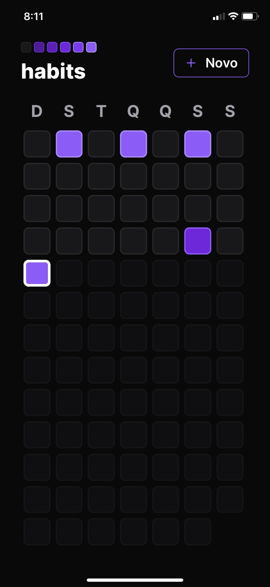
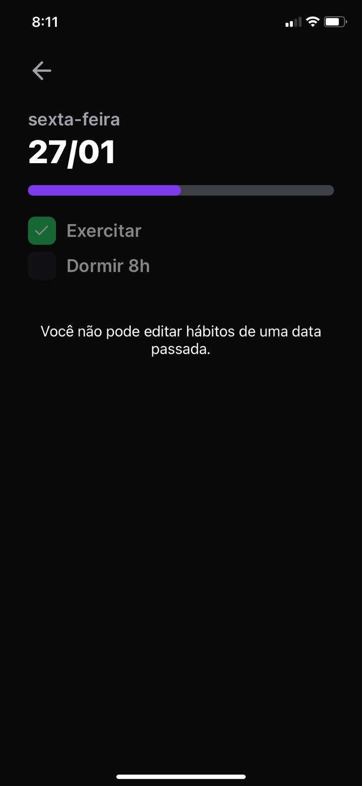
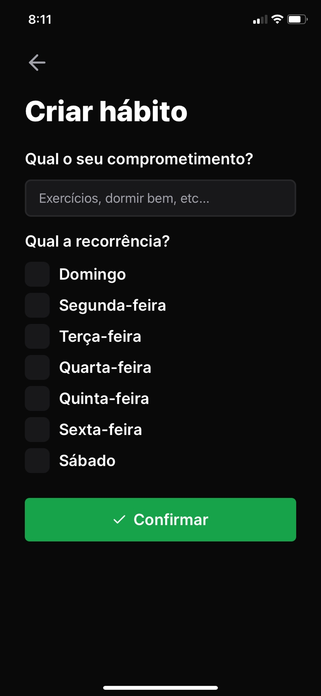

  <a href="#-tecnologias">Tecnologias</a>&nbsp;&nbsp;&nbsp;|&nbsp;&nbsp;&nbsp;
  <a href="#-projeto">Projeto</a>&nbsp;&nbsp;&nbsp;|&nbsp;&nbsp;&nbsp;
  <a href="#-como-rodar">Como rodar</a>&nbsp;&nbsp;&nbsp;|&nbsp;&nbsp;&nbsp;
  <a href="#-como-contribuir">Como contribuir</a>&nbsp;&nbsp;&nbsp;
  

 

  

  

  

## NLW Setup - Habits

## 🚀 Tecnologias

Esse projeto foi desenvolvido com as seguintes tecnologias:

- [Nodejs](https://nodejs.org/en/) - v18.12.1
- [Npm](https://www.npmjs.com/) - 8.19.2
- [React Native](https://reactnative.dev/)
- [TypeScript](https://www.typescriptlang.org/)
- [Expo](https://expo.dev/)
- [NativeWind](https://www.nativewind.dev/)
- [clsx](https://github.com/lukeed/clsx)
- [dayjs](https://github.com/iamkun/dayjs)

## 💻 Projeto

Projeto desenvolvido com React Native para a criação e manutenção de hábitos do dia no iOS e Android.

Evento do NLW na plataforma da [Rocketseat](https://www.rocketseat.com.br/).

- [Backend - API](https://github.com/leticea/habits-app-nlw-api)
- [Frontend Reactjs - Web](https://github.com/leticea/habits-app-nlw-react)

## 🚀 Como Rodar

- Clone o projeto.
- Clone o projeto da API para rodar o projeto junto.
- Entre na pasta do projeto e rode 'npm install' (use 'yarn install' se for essa a sua configuração).
- Rodar o comando npx expo start para abrir no emulador ou no telefone físico.
- Caso <b>não<b> tenha o expo instalado, seguir o passo a passo da [Rocketseat](https://react-native.rocketseat.dev/).

## 🤔 Como contribuir

- Faça um fork desse repositório;
- Cria uma branch com a sua feature: `git checkout -b minha-feature`;
- Faça commit das suas alterações: `git commit -m 'feat: Minha nova feature'`;
- Faça push para a sua branch: `git push origin minha-feature`.

Depois que o merge da sua pull request for feito, você pode deletar a sua branch.

## 📝 Licença

Esse projeto está sob a licença MIT.